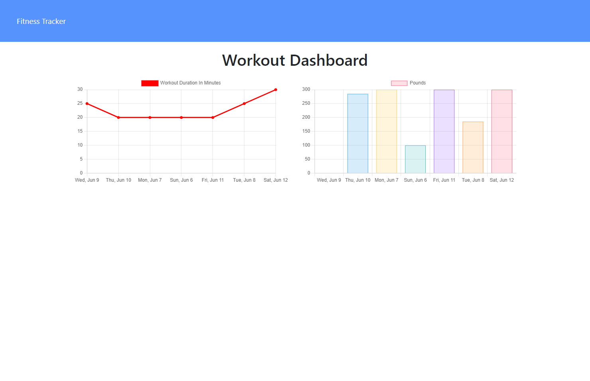

# Fitness Tracker

## Description
Fitness Tracker is an app to track user's daily resistance and cardio workouts. The user can also view their last 7 workouts in their dashboard through graphs to help visualize progress.
## Table of Contents

* [Installation](#installation)
* [Usage](#usage)
* [License](#license)
* [Tests](#tests)
* [Contributing](#contributing)
* [Questions](#questions)

## Installation
***
Simply used the deployed version or run npm i to create a locally hosted version!

## Usage
***
Due to the nature of the app, the deployed version will not seperate your data from another user's data. For a personalized experience, please download and host a local version.

## License
***
Unlicensed

## Tests
***
None at this time

## Contributing
***
If you would like to contribute please email me

## Questions
***
https://github.com/zchalk

If you have further questions, suggestions, or business inquiries please contact me via email: mailto:zoechalk1@gmail.com
